## Australia Registered Businesses Statistic
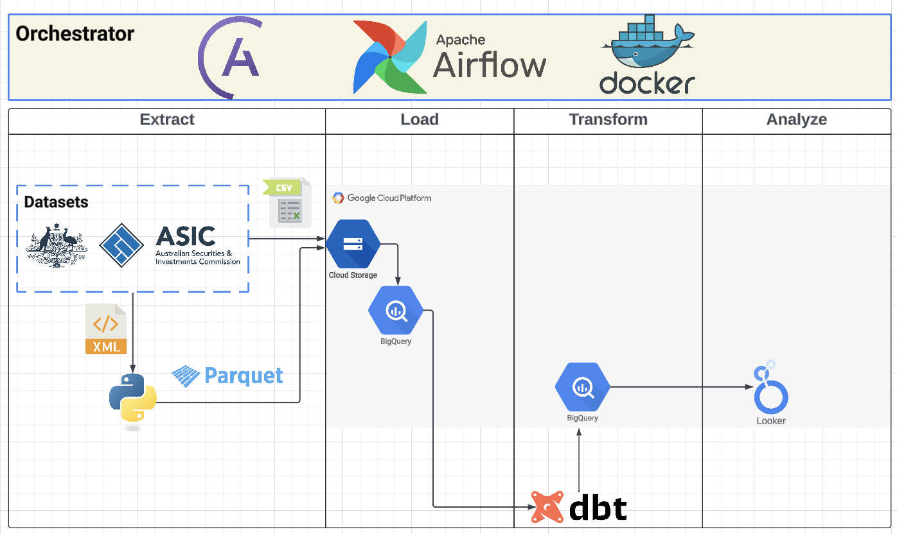
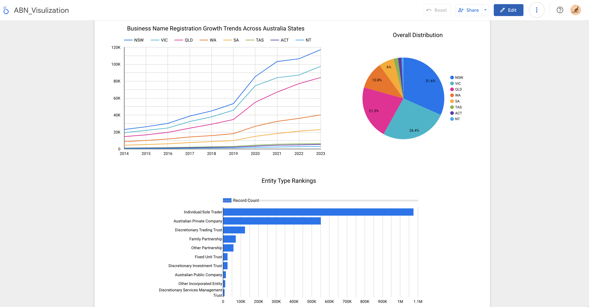
Please check the dashboard here:https://lookerstudio.google.com/s/jxgU55g2YbA

### Target: In this project, I would like to analysis the business registration in Australia year over year. In my data visualization part, I would like to answer below questions:

- 1. Last 10 years ABN statistic in Australia

- 2. Business entity type ranking in Australia


**Prerequisites:**
*  <1>Docker
*  <2>GCP account
*  <3>Astro with airflow 
We will be using airflow to orchestrate the project, and astro to quickly implement the airflow docker environment in our computer.
To download astro, please follow the link:https://docs.astronomer.io/astro/cli/install-cli

I use mac, so I use "brew install astro"

After install the astro cli, make a project folder, then run "astro dev init", it will initialize the airflow frame.

Then,run "astro dev start", it will start the docker VM.This command will spin up 4 Docker containers on your machine, each for a different Airflow component:

- Postgres: Airflow's Metadata Database
- Webserver: The Airflow component responsible for rendering the Airflow UI
- Scheduler: The Airflow component responsible for monitoring and triggering tasks
- Triggerer: The Airflow component responsible for triggering deferred tasks

> [!IMPORTANT]
> 
> Once in the VM, in our dags or other python file, when we refer to the local file,we need first run "astro dev bash", and then "pwd" to check the directory.
> 
> Access the Airflow UI through http://localhost:8080/ and log in with 'admin' for both Username and Password.

**Steps:**
* [1.Dataset download](#data-source)
* [2.Airflow](#extract-data)
* [3.Data Storing (BigQuery)](#load-data)
* [4.Data Transform (DBT cloud IDE)](#transform-data)
* [5.Data Presentation (Looker Studio)](#visualize-data)

### Data Source:
Please put the downloaded files under include/datasets
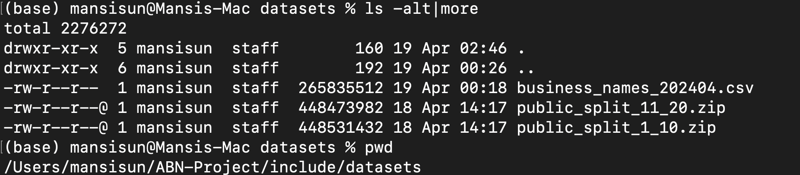

[1. Business Names](https://data.gov.au/data/dataset/asic-business-names) https://data.gov.au/data/dataset/asic-business-names

**File downloaded:**
    "Business Names Dataset - Help File" & "Business Names Dataset - Current"

> [!NOTE]
> The data set contains below information:
>   * Business Name
>   * Status
>   * Date of registration
>   * Date of Cancellation
>   * Renewal Date
>   * Former State Number(where applicable)
>   * Previous State of Registration
>   * Australia Business Number(ABN)
> 
> As above data is not sufficient enough for the later on agrregation and visualization, so we could enrich our dataset by adding Entity type and state information, which could be fetched in below link.

[2. Entity Type & State](https://data.gov.au/data/dataset/abn-bulk-extract) https://data.gov.au/data/dataset/abn-bulk-extract

**File downloaded:**
    ABN Bulk Extract Part1 & ABN Bulk Extract Part2

> [!NOTE]
> The files are XML files which will need more than 10GB disk space. To make things simple, I only extracted the columns (ABN,Entity type,State) we needed, and converted them into parquet files for later use. 
>
> The convert script located in "include/extract/XML_to_Parquet.py" 
>
> The 20 converted files located in "include/datasets/*.parquet" 
### Extract Data:

Below is the main files I created:

dags/abn_new.py **airflow dag**
plugins/operators/zip.py    **airflow plugin in order to unzip downloaded datasets**
include/datasets    **Store datasets locally**
include/extract/XML_to_Parquet.py   **Script used to extract the columns we needed from the big XML files**
include/gcp/service_account.json    **The GCP service account key, make sure include the file in your .gitignore file, and do not share with others**
.gitignore  **I added some other folders which is not suitable for sharing**
.env    **add code to enable airflow connection test button**

After copy files to target destination, we could login in airflow UI, enable the abn_new dag, and trigger it, the whole process would take approximately 15 minutes.
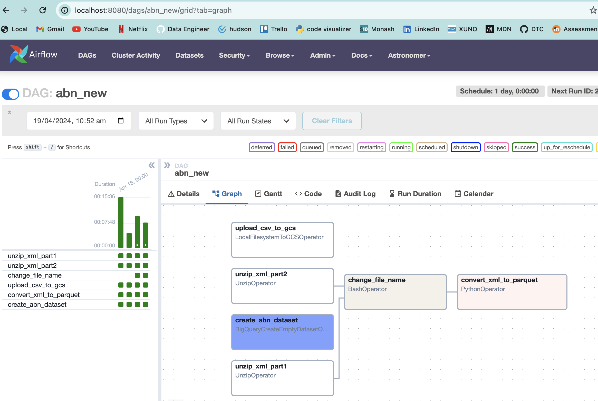

### Load Data:
> [!NOTE]
> We are using Google Cloud Platform for our data storage. If you're new to GCP, you could have 3 months free trial.

I will create a bucket to upload the parquet files as well as business names csv file.

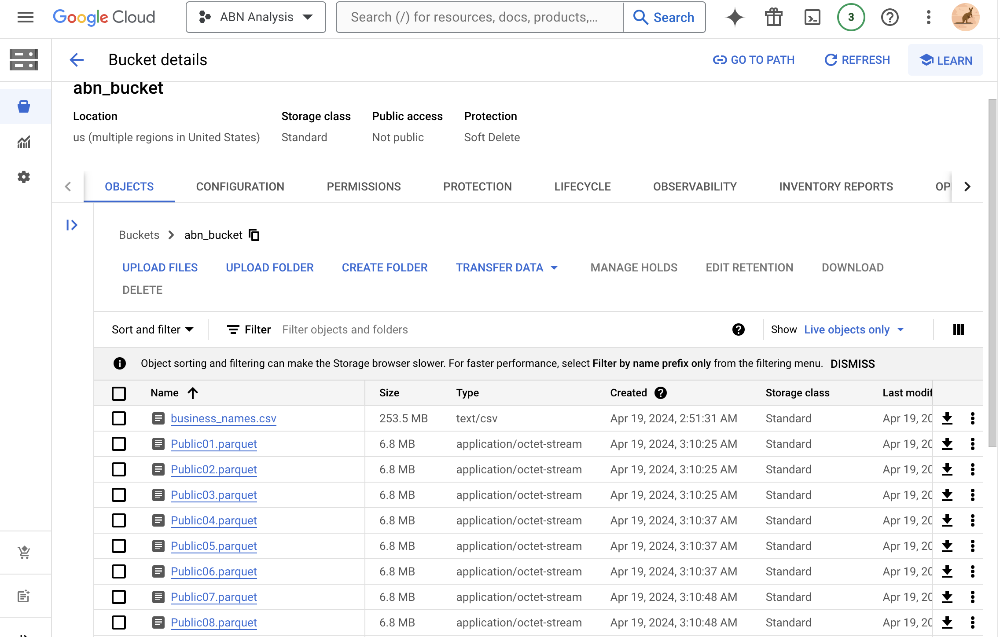

Now open BigQuery, under abn dataset we created in airflow,run below sql one by one to create the table, in abn_names table, we will use partition on column bn_reg_dt as we will only fetch last 10 years data, this will improve the performance of query 
```sql
create or replace external table abn.additional_info 
options( 
    format = 'PARQUET', 
    uris = ['gs://abn_bucket/*.parquet'] );

create or replace external table abn.abn_names_external
options( 
    format = 'CSV', 
    uris = ['gs://abn_bucket/*.csv'] );

create or replace table abn.abn_names
partition by 
date_trunc(bn_reg_dt,YEAR) as
select * from abn.abn_names_external
```

### Transform Data:
We will be using dbt Cloud to transform data, we could enroll a developer account in dbt for free. Create a new project and connect to Repository(Github) and data warehouse(BigQuery).
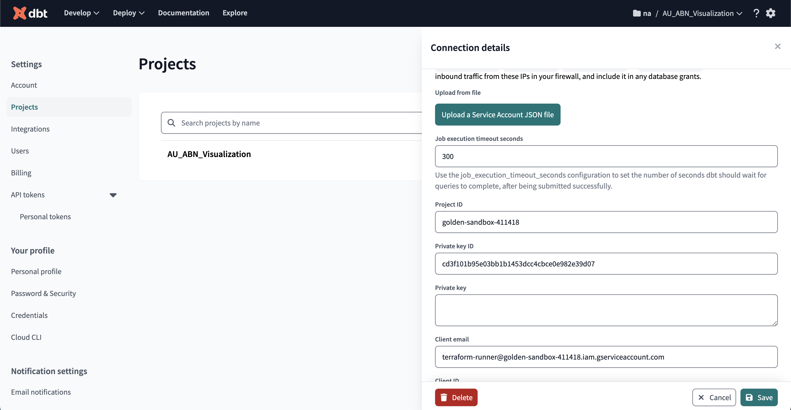
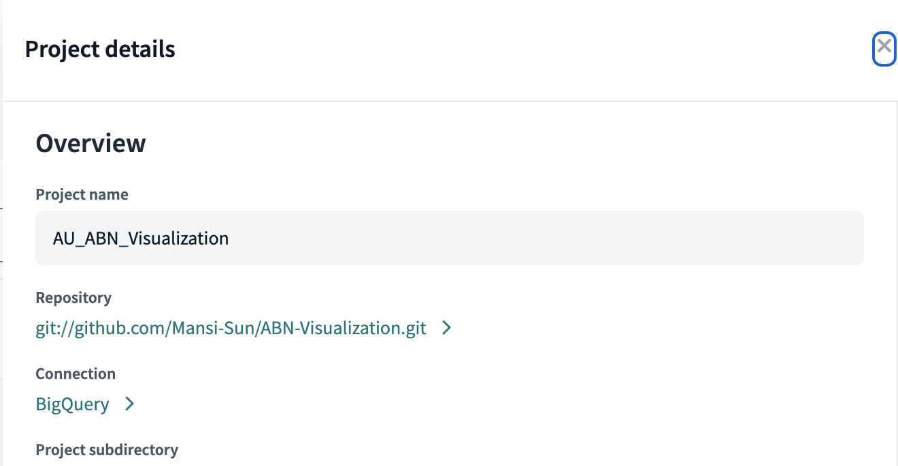

**1.Study the data**
**Check the null value**

```sql
(select "Null ABN NUMBER during last 10 years",count(*) from `abn.abn_names`
where extract(year FROM bn_reg_dt) between 2014 and 2024
and bn_abn is null)
union all
(select "Total Records during last 10 years",count(*) from `abn.abn_names`
where extract(year FROM bn_reg_dt) between 2014 and 2024);
```

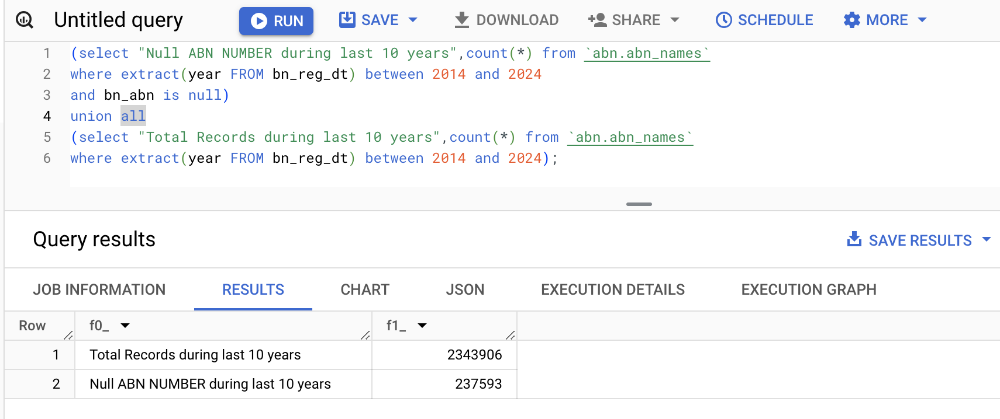

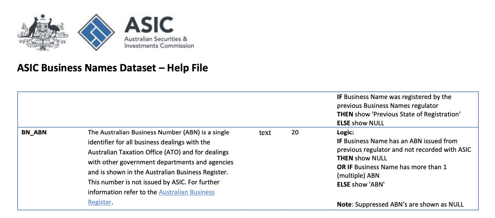

>[!Note]
> After examing the data, I noticed there are some null value in bn_abn numbers.
> According to the help document you may find in "Info/business-names-dataset-help-file.pdf", the data is null either due to transfered from previous regulator or the business name has multiple abns.
> Due to above reasons, we will filter out those data accordingly.

**2.Define the source table**
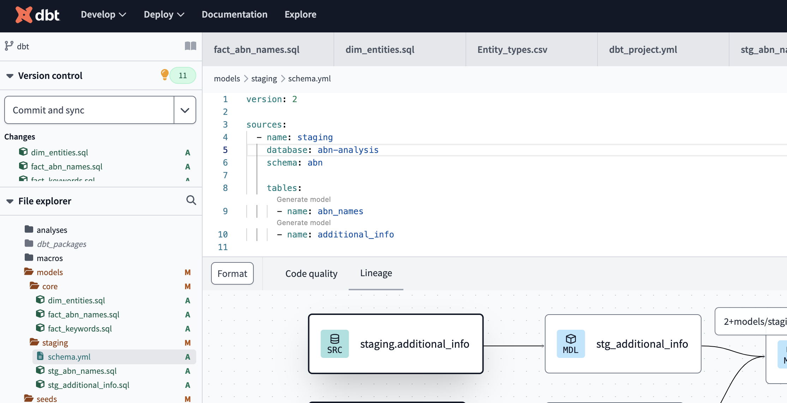

**3.Data Modeling**
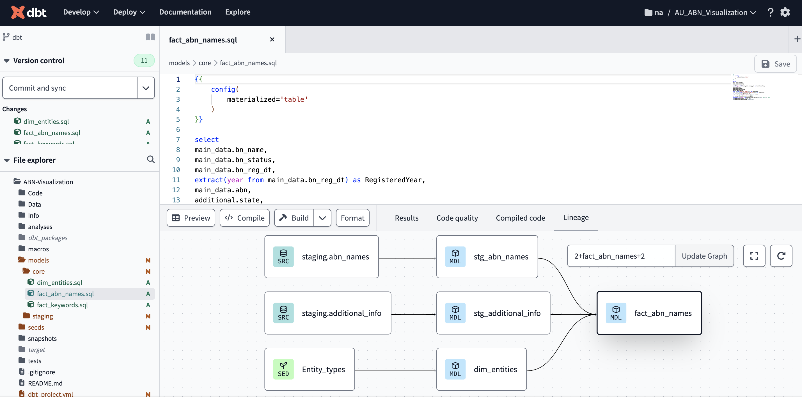

Build seeds/Entity_types.csv file with command:
"dbt build --select Entity_types"

Then "dbt run", the fact table will be stored in BigQuery
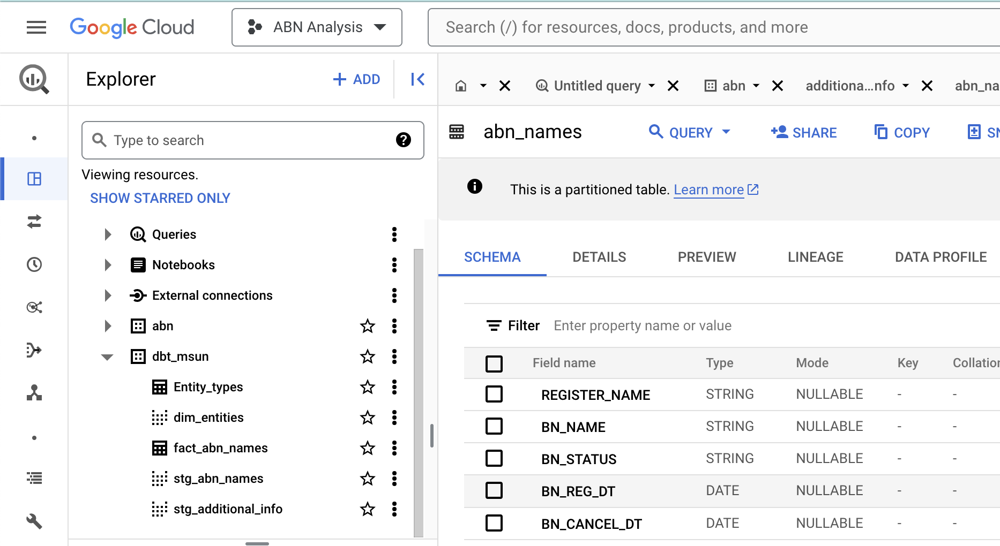

### Visualize Data:
We will use Google Looker Studio to do the data visualization.

Create "Data Source", and choose BigQuery, and then choose the fact table we transformed.
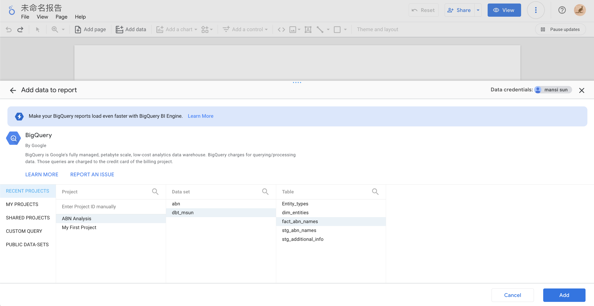
